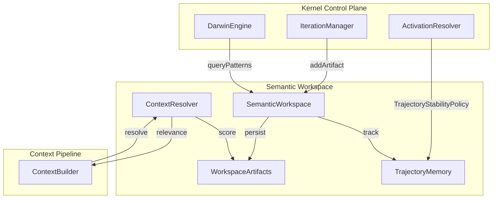

# Semantic Workspace Architecture

# Semantic Workspace Architecture

## Overview

The Semantic Workspace is a persistent reasoning environment for the orchestration kernel. It solves the problem of "isolated prompt execution" by providing a mechanism for iterations to share semantic knowledge, track long-running trajectories, and avoid redundant rediscovery of conclusions.

The system treats the orchestration process as a "reasoning operating system" where conclusions are persisted artifacts rather than transient prompt outputs.

## Core Principles

1.  **Semantic Continuity**: Reasoning fragments (conclusions, decisions, patterns) persist across iterations.
2.  **Adaptive Grounding**: Context injection is based on relevance-ranked semantic artifacts rather than simple file matching.
3.  **Knowledge Decay**: Memory self-stabilizes by weakening stale or unreinforced artifacts.
4.  **Trajectory Stability**: Long-running behavior paths are tracked to steer mutation and avoid failure loops.

## Components

### 1. SemanticWorkspace
The central repository for `WorkspaceArtifacts` and `TrajectoryMemory`. It provides APIs for adding, reinforcing, and decaying knowledge.

### 2. WorkspaceArtifact
Represents a discrete unit of reusable knowledge.
- **Types**: `clarification-conclusion`, `architecture-summary`, `implementation-decision`, `mutation-pattern`, `failure-cause`.
- **Metadata**: Confidence, source iteration, lineage, semantic tags, decay score.

### 3. TrajectoryMemory
Tracks historical patterns to guide future decisions.
- **Reliability Tracking**: Maintains success/failure counts for every mutation strategy.
- **Successful strategies**: Long-term record of effective approaches.
- **Recurring failure loops**: Identifies strategies that consistently result in build or test failures.
- **User-preferred solution styles**: Preserves stylistic preferences across sessions.

### 4. ContextResolver
The engine that determines which artifacts are relevant to the current task. It scores artifacts based on:
- Keyword/Tag matching with the current goal.
- Artifact confidence.
- Decay score (recency/reinforcement).
- Artifact type priority.

## Architecture Diagram

## Lifecycle & Flows

### Artifact Promotion Flow
1.  **Agent Execution**: An agent (e.g., `IntentExpansionEngine`) performs reasoning.
2.  **Artifact Creation**: The agent identifies a high-confidence conclusion.
3.  **Workspace Publication**: The artifact is published to the `SemanticWorkspace`.
4.  **Telemetry**: A `ARTIFACT_PROMOTED` signal is emitted.

### Retrieval Flow
1.  **Task Initialization**: `ContextBuilder` starts building the prompt for a task.
2.  **Adaptive Goal Construction**: The current goal is enriched with phase and trajectory metadata.
3.  **Semantic Query**: `ContextResolver` queries the workspace for artifacts relevant to the enriched goal.
4.  **Relevance Ranking**: Artifacts are scored and ranked based on confidence, decay, and type.
5.  **Trajectory Filtering**: Artifacts are filtered based on the current trajectory's stability score.
6.  **Prompt Injection**: Top-ranked artifacts are formatted and injected into the prompt.

### Decay & Stabilization
- The workspace applies a `DECAY_FACTOR` (0.95) to artifacts over time or upon specific events.
- Artifacts with scores below a threshold (0.1) are pruned.
- Successful reuse of an artifact reinforces it, resetting its decay score.

## Migration from File-Centric Context

The system has transitioned from a strictly file-centric context model to a hybrid semantic model.

- **Old Model**: Context was gathered by matching file patterns in the prompt and reading their raw content.
- **New Model**:
    1.  Files are still gathered for immediate implementation scope.
    2.  `SemanticWorkspace` provides high-level architectural summaries, previously resolved ambiguities, and historical implementation decisions.
    3.  This reduces prompt noise by providing synthesized reasoning instead of raw file dumps for global context.

## Decision Integration: TrajectoryStabilityPolicy

The `ActivationResolver` now includes a `TrajectoryStabilityPolicy` that:
1.  Retrieves the `strategy` of each candidate Darwin branch.
2.  Queries `TrajectoryMemory` for the historical reliability of that strategy.
3.  Penalizes variants using high-failure strategies and boosts variants using proven successful patterns.
4.  Ensures the system "learns" to avoid dead-end implementation paths.

## Telemetry Signals

- `CONTEXT_RETRIEVED`: Emitted when the workspace provides context for a task.
- `ARTIFACT_PROMOTED`: Emitted when new knowledge is stored.
- `TRAJECTORY_STRENGTHENED`: Emitted when a successful strategy is reinforced.
- `MEMORY_DECAY_APPLIED`: Emitted during workspace stabilization.
- `CONTEXT_OVERLOAD_DETECTED`: Emitted if too many artifacts compete for relevance.
