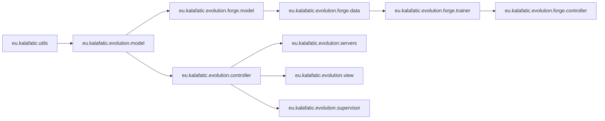

# Module & Bundle Inventory

## OSGi Bundle Taxonomy

The EVO codebase consists of 29 Maven/Tycho OSGi bundle projects structured under the aggregator `eu.kalafatic.evolution.aggregator`.

---

## Detailed Bundle Catalog

| Bundle Symbolic Name | Type | Purpose & Responsibility | Key Packages / Entry Points | Build Role |
| :--- | :--- | :--- | :--- | :--- |
| `eu.kalafatic.utils` | OSGi Plugin | Shared utilities, string manipulation, constants, process helpers. | `eu.kalafatic.utils`, `eu.kalafatic.utils.constants.FUIConstants` | Core utility library |
| `eu.kalafatic.evolution.model` | OSGi Plugin | Persistent EMF domain model (`evolution.ecore`). | `eu.kalafatic.evolution.model.orchestration` | Core data model |
| `eu.kalafatic.evolution.model.edit` | OSGi Plugin | EMF Edit providers for UI property sheets and trees. | `eu.kalafatic.evolution.model.orchestration.provider` | EMF UI Edit support |
| `eu.kalafatic.evolution.model.editor` | OSGi Plugin | EMF generated editor UI components. | `eu.kalafatic.evolution.model.orchestration.presentation` | EMF UI presentation |
| `eu.kalafatic.evolution.model.tests` | Test Plugin | JUnit 3 tests for generated EMF model classes. | `eu.kalafatic.evolution.model.orchestration.tests` | EMF Model test suite |
| `eu.kalafatic.evolution.controller` | OSGi Plugin | Core orchestration, resource management, Darwin engine, Self-Dev engine. | `eu.kalafatic.evolution.controller.resource.ResourceManager`, `eu.kalafatic.evolution.controller.orchestration.cognitive.loop.CognitiveLoopEngine` | Central logic bundle |
| `eu.kalafatic.evolution.controller.tests` | Test Plugin | Unit and integration tests for controllers and tasks. | `eu.kalafatic.evolution.controller.tests` | Controller test suite |
| `eu.kalafatic.evolution.servers` | OSGi Plugin | Embedded NanoHTTPD web servers, REST endpoints, OSGi bundle state queries. | `eu.kalafatic.evolution.servers.EvolutionServer`, `eu.kalafatic.evolution.servers.mcp` | HTTP / MCP service |
| `eu.kalafatic.evolution.view` | OSGi Plugin | Main Eclipse RCP UI, views, editors, pages, menus. | `eu.kalafatic.evolution.view.editors.MultiPageEditor`, `eu.kalafatic.evolution.view.editors.pages.DevelopmentPage` | RCP UI Application |
| `eu.kalafatic.evolution.supervisor` | OSGi Plugin | External process supervisor, REST control server, runner. | `eu.kalafatic.evolution.supervisor.SupervisorMain`, `eu.kalafatic.evolution.supervisor.EVOSupervisorServer` | Process Supervisor |
| `eu.kalafatic.evolution.selfdev.genome` | OSGi Plugin | Self-Dev genome definitions and task scenarios. | `eu.kalafatic.evolution.selfdev.genome` | Self-Dev scenarios |
| `eu.kalafatic.evolution.selfdev.genome.tests` | Test Plugin | Tests for Self-Dev genome pipelines. | `eu.kalafatic.evolution.selfdev.genome.tests` | Genome test suite |
| `eu.kalafatic.evolution.forge.tokenizer` | OSGi Plugin | SimpleBPETokenizer and character-level tokenizers. | `eu.kalafatic.evolution.forge.tokenizer` | LLM Tokenizer |
| `eu.kalafatic.evolution.forge.math` | OSGi Plugin | Tensor operations, matrix math, activation functions. | `eu.kalafatic.evolution.forge.math` | Neural Math |
| `eu.kalafatic.evolution.forge.model` | OSGi Plugin | `EvoLlmArchitecture`, `EvoModelArtifact`, model sizes. | `eu.kalafatic.evolution.forge.model.llm` | LLM Model specs |
| `eu.kalafatic.evolution.forge.observability` | OSGi Plugin | Loss tracking, progress monitors, metrics recording. | `eu.kalafatic.evolution.forge.observability` | Training metrics |
| `eu.kalafatic.evolution.forge.agent.api` | OSGi Plugin | Agent APIs for Forge source analysis. | `eu.kalafatic.evolution.forge.agent.api` | Forge Agent interfaces |
| `eu.kalafatic.evolution.forge.runtime` | OSGi Plugin | Native Java LLM inference runtime. | `eu.kalafatic.evolution.forge.runtime` | Inference runtime |
| `eu.kalafatic.evolution.forge.data` | OSGi Plugin | Dataset acquisition, Hugging Face downloader, `.evodata` writer. | `eu.kalafatic.evolution.forge.data.impl.service.TrainingDataAcquisitionServiceImpl` | Dataset pipeline |
| `eu.kalafatic.evolution.forge.trainer` | OSGi Plugin | `EvoLlmTrainer` neural network optimizer and training loop. | `eu.kalafatic.evolution.forge.trainer.EvoLlmTrainer` | LLM Training engine |
| `eu.kalafatic.evolution.forge.controller` | OSGi Plugin | `ForgeOrchestratorImpl`, `ForgeJob` lifecycle manager. | `eu.kalafatic.evolution.forge.controller.impl.ForgeOrchestratorImpl` | Forge Orchestration |
| `eu.kalafatic.evolution.forge-lab` | OSGi Plugin | Experimental models and playground components. | `eu.kalafatic.evolution.forge.lab` | Experimental Forge |
| `eu.kalafatic.evolution.creatic` | OSGi Plugin | Code creative generators and agent prompts. | `eu.kalafatic.evolution.creatic` | Code generation |
| `eu.kalafatic.evolution.media` | OSGi Plugin | Image assets, flags, UI graphics. | `eu.kalafatic.evolution.media` | Media assets |
| `eu.kalafatic.evolution.tests` | Test Plugin | Platform level integration tests. | `eu.kalafatic.evolution.tests` | Integration tests |
| `eu.kalafatic.evolution.quality.tests` | Test Plugin | Quality checks and static code compliance tests. | `eu.kalafatic.evolution.quality.tests` | Quality test suite |
| `eu.kalafatic.evolution.feature` | Eclipse Feature | Packages all EVO OSGi bundles into a feature. | `feature.xml` | Feature aggregator |
| `eu.kalafatic.evolution.repository` | Eclipse Product | Tycho product export packaging (`evolution.product`, `evo.product`). | `evolution.product`, `evo.product` | Product export |
| `eu.kalafatic.evolution.module` | POM | Aggregator module for sub-projects. | `pom.xml` | Tycho build module |

---

## Key Public APIs & Boundaries

1. **`eu.kalafatic.evolution.controller`**:
   * `ResourceManager.getInstance()`: Persistent configuration access.
   * `CognitiveLoopEngine.solve(...)`: Goal-driven strategy executor.
   * `SelfDevOrchestrator`: Self-development run manager.
2. **`eu.kalafatic.evolution.forge.controller`**:
   * `ForgeOrchestratorImpl`: Main entry point for dataset acquisition, training, and model export.
3. **`eu.kalafatic.evolution.servers`**:
   * `EvolutionServer`: Embedded server exposing HTTP endpoints (`/develop/task`, `/forge/dataset/prepare`, `/server/osgi`).
