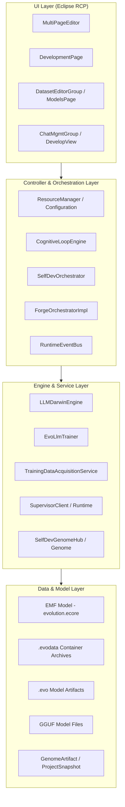

# System Overview & Architecture

## High-Level System Architecture

**EVO** is an integrated software engineering platform designed to combine local and remote Large Language Models (LLMs), agentic repository modification loops, autonomous training dataset compilation, native neural network model forging, self-guided workspace evolution, and structural evolution mapping through Genome.

The system is constructed as an OSGi-based modular workbench using the Eclipse Rich Client Platform (RCP) target platform, built with Apache Maven and Tycho 4.0.5.

---

## Key Architectural Layers

### 1. Presentation & Workbench Layer (`eu.kalafatic.evolution.view`)
* **Framework**: Eclipse RCP, SWT, JFace, E4 Workbench.
* **Core Components**:
  * `MultiPageEditor`: Multi-tab editor binding EMF models (`.evo` / `evo_config.xml`) to visual editors.
  * `DevelopmentPage`: Self-Development pipeline control, table task order management, context actions.
  * `DatasetEditorGroup`: UI for dataset candidate discovery, download, preview, and `.evodata` compilation.
  * SWT Browser Visualizers: Pure JavaScript/SVG visualizers (`iterativeBrowser`, `statusBrowser`, `workflow.html`) rendered via embedded SWT Browser controls with thread-safe `asyncExec` JavaScript bridges.

### 2. Orchestration & Controller Layer (`eu.kalafatic.evolution.controller`)
* **Role**: Coordinates task pipelines, enforces system boundaries, bridges UI actions to underlying engines, and manages persistent system state.
* **Core Components**:
  * `ResourceManager`: Single persistent configuration authority over EMF models. Enforces canonical filesystem rules (`validateCanonicalPath`).
  * `CognitiveLoopEngine`: Adaptive goal-driven controller executing `CognitiveGoal` objectives through decoupled `CognitiveStrategy` implementations.
  * `SelfDevOrchestrator`: Task graph executor running sequential workspace evolution steps (`GIT_CHECK` -> `COPY` -> `BUILD` -> `EXPORT` -> `START` -> `VERIFY`).
  * `RuntimeEventBus`: Event-driven pub/sub bus broadcasting system runtime events (`VIEW_UPDATED`, `TASK_FAILED`, `STEP_WAITING`) across plugins.

### 3. Subsystem Engines (`eu.kalafatic.evolution.forge.*`, `eu.kalafatic.evolution.supervisor`, `eu.kalafatic.evolution.selfdev.genome`)
* **Forge LLM Engine**: End-to-end dataset acquisition, character/BPE tokenization (`SimpleBPETokenizer`), model architecture modeling (`EvoLlmArchitecture`), and native Java LLM training (`EvoLlmTrainer`).
* **Darwin Engine**: Agentic code modification engine (`LLMDarwinEngine`) running intent expansion, candidate generation, patch application, and compilation verification.
* **Supervisor Subsystem**: Standalone process supervisor (`SupervisorMain`) running HTTP/REST servers (`EVOSupervisorServer` on port 8089, `EVOSupervisorControlServer` on port 28080) for external task control and process lifecycle monitoring.
* **Genome Subsystem**: Evolution tracking and self-upgrade mapping engine (`SelfDevGenomeHub`, `GenomeRepository`, `MilestoneGenerator`, `SecondhandUpgradeEngine`) that records structural project snapshots, milestone transitions, and architectural changes (`ArchitecturalChange`).

### 4. Persistence & Artifact Layer (`eu.kalafatic.evolution.model`, `eu.kalafatic.evolution.forge.data`, `eu.kalafatic.evolution.selfdev.genome`)
* **EMF Model**: `evolution.ecore` defines persistent state (`EvolutionProject`, `SelfDevContext`, `ForgeSession`, `NetworkEntry`).
* **Binary Artifacts**:
  * `.evodata`: Binary Zip container holding dataset manifest, train/validation JSONL streams, and schema metadata.
  * `.evo`: Native binary LLM model container storing `EvoLlmArchitecture`, `EvoTokenizerArtifact`, and trained float weights.
  * GGUF: Exported format for inference compatibility with `llama.cpp` and `Ollama`.
* **Genome Artifacts**:
  * `ProjectSnapshot` & `GenomeArtifact`: Canonical representations of project structural state, metrics, and milestone history.

---

## Architectural Principles & Constraints

1. **EMF Model Authority**: `ResourceManager` is the sole configuration accessor layer over the EMF model. Configuration is never duplicated in external properties files.
2. **Canonical Filesystem Boundaries**: All path operations are strictly constrained to:
   * Source repositories under `${user.home}/git/`
   * Persistent workspace under `${user.home}/workspace/`
   * Runtime executions under `${user.home}/workspace/runtime/`
   Paths outside these boundaries trigger fast-fail validation exceptions (`validateCanonicalPath`).
3. **Thread-Safe UI Operations**: Background execution runs in Eclipse `Job` instances or thread pools. UI widget updates and SWT Browser JavaScript execution MUST be dispatched on the SWT UI thread via `Display.getDefault().asyncExec(...)` with explicit `!control.isDisposed()` guards.
4. **Non-Blocking Workbench Startup**: Heavy scanning operations (Git repository discovery, EGit cache lookup, remote dataset cataloging) are offloaded from `earlyStartup()` to background `Job` instances to maintain instant workbench responsiveness.
