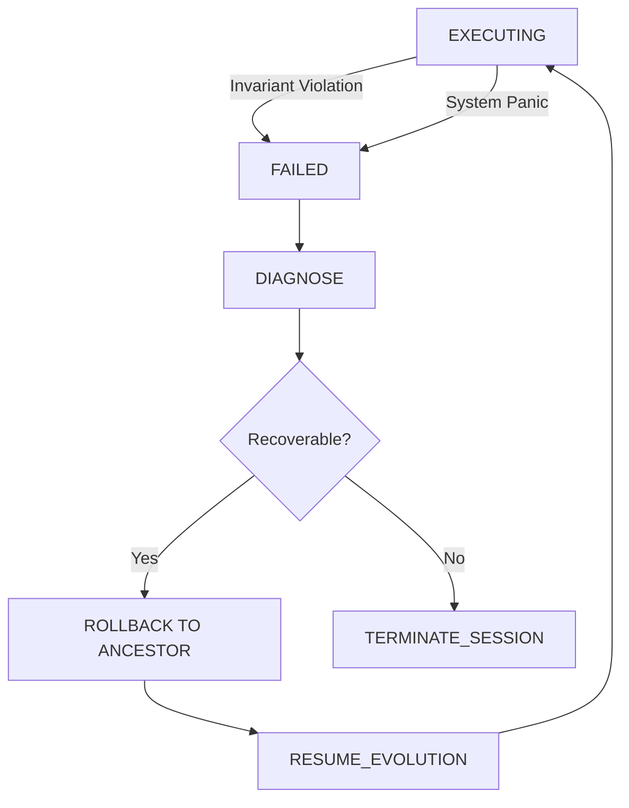

# ECOS_ORCHESTRATOR_SPEC.md

## Overview
This document specifies the lifecycles and behaviors of the ECOS Orchestrator.

---

## 1. System Lifecycle
The ECOS system transitions through the following high-level states:

1. **BOOT**: Core OS services and Event Bus initialized.
2. **ENVIRONMENT_PROVISION**: Active `EvolutionEnvironment` selected based on task context.
3. **GROUNDING**: Initial repository scan and pressure discovery.
4. **COGNITION_LOOP**: Recursive evolution of artifacts.
5. **CONVERGENCE**: Architectural equilibrium reached.
6. **TERMINATION**: Results exported, lineage persisted, environment cleanup.

---

## 2. Evolution Lifecycle (Darwin Loop)
The evolution of a single artifact follows this repeatable process:

1. **PRESSURE_ANALYSIS**: `EvolutionaryPressureEngine` identifies driving forces.
2. **MUTATION_PLANNING**: `MutationEngine` requests divergent Blueprints citing resolved pressures.
3. **MATERIALIZATION**: `DarwinEngine` generates artifact variants (descendants of the ancestor).
4. **EVALUATION**: `FitnessEngine` aggregates environment-specific signals.
5. **SELECTION**: `AuthorityEngine` chooses the survivor based on pressure-reduction fitness.
6. **INHERITANCE**: The survivor becomes the new ancestor in the `SurvivingLineage`.

---

## 3. Constraint Enforcement Lifecycle
Every iteration enforces ECOS invariants:

1. **PRE_MUTATION**: Verify that the mutation request originates from the Kernel.
2. **POST_MUTATION**: Verify that the spawned variantscite a surviving ancestor.
3. **PRE_SELECTION**: Verify that candidates do not violate architectural constraints.
4. **POST_SELECTION**: Record the decision and rationale in the persistent `CognitiveTrace`.

---

## 4. Supervisor Lifecycle
Supervision operates externally to the Kernel:

1. **MONITOR**: Watch Kernel health, event bus signals, and resource usage.
2. **EVALUATE**: Compare Kernel progress against global policies.
3. **INTERVENE**: Pause, restart, or rollback Kernel execution if invariants are violated.
4. **RECOVER**: Restore Kernel from the latest valid `SurvivingLineage` checkpoint.

---

## 5. Failure & Recovery Lifecycle

### State Diagram (Markdown)

---

## 6. Knowledge Lifecycle
How information persists and evolves:

1. **ARTIFACT_CREATION**: Temporary implementation created during mutation.
2. **SURVIVAL**: Successful artifact linked to the lineage.
3. **SEMANTIC_ABSTRACTION**: `MetadataAgent` extracts architectural significance from the survivor.
4. **MEMORY_INTEGRATION**: Abstracted knowledge added to `EvolutionaryMemory` for future iterations.
